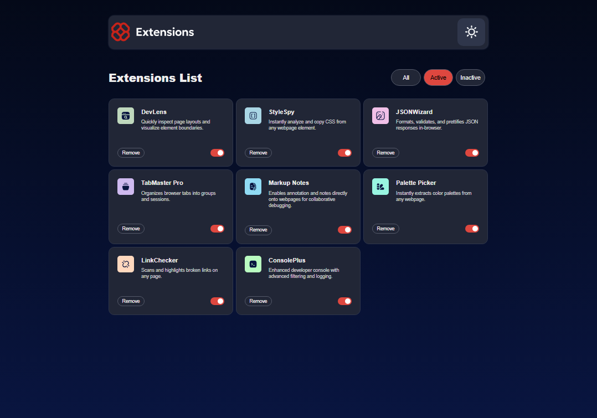

# browser-extensions-manager-ui-main
browser-extensions-manager-ui-main

This is a solution to the [browser-extensions-manager-ui-main on Frontend Mentor](https://www.frontendmentor.io/challenges/browser-extension-manager-ui-yNZnOfsMAp). Frontend Mentor challenges help you improve your coding skills by building realistic projects. 

## Table of contents

- [Overview](#overview)
  - [Screenshot](#screenshot)
  - [Links](#links)
- [My process](#my-process)
  - [Built with](#built-with)
  - [What I learned](#what-i-learned)
  - [Continued development](#continued-development)
- [Author](#author)

## Overview

### Screenshot

These are my screenshots showing how the project turned out.

- Mobile design dark theme:


- Desktop design dark theme:


- Desktop design active dark theme:



- Desktop design inactive dark theme:


- Desktop design focus dark theme:


- Desktop design hover dark theme:


- Mobile design light theme:


- Desktop design light theme:


- Desktop design active light theme:


- Desktop design inactive light theme:


- Desktop design focus light theme:


- Desktop design hover light theme:


### Links

- Solution URL: [My Solution](https://github.com/gillaercio/base-apparel-coming-soon-master)

## My process

### Built with

- Semantic HTML5 markup
- CSS custom properties
- Grid Layout
- Mobile-first workflow
- JavaScript

### What I learned

I took advantage of this project to practice using **aria-selected** with **CSS** and **.json** with **JavaScript**:

Interactivity with aria-selected

```html
<div class="filter-tab" role="tablist" aria-label="Extension filter tabs">
  <button role="tab" aria-selected="true" data-filter="all">All</button>
  <button role="tab" aria-selected="false" data-filter="active">Active</button>
  <button role="tab" aria-selected="false" data-filter="inactive">Inactive</button>
</div>
```

Data storage with .json

```js
fetch("assets/data/data.json")
  .then(response => response.json())
  .then(data => {
    allExtensions = data;
    renderExtensions(allExtensions);
  })
  .catch(error => {
    console.error("Error loading JSON:", error);
    container.innerHTML = "<p style='color: white;'>Error loading extensions.</p>";
  });
```

### Continued development

I would like to improve the use of the **HTML**, **CSS** and **JavaScript**.

## Author

- Frontend Mentor - [@gillaercio](https://www.frontendmentor.io/profile/gillaercio)
- Github - [My Github](https://github.com/gillaercio)
- LinkedIn - [My LinkedIn](https://www.linkedin.com/in/gildman-la%C3%A9rcio/)